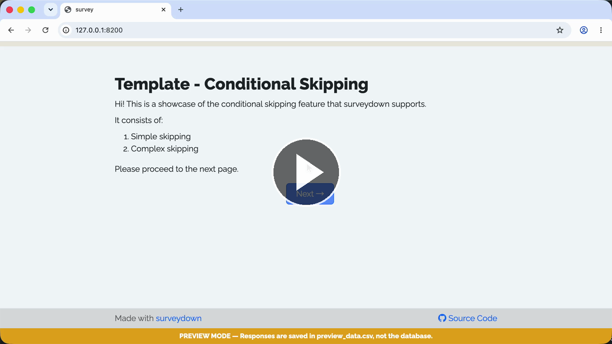

# Template - Conditional Skipping

A template of conditional skipping (skip to a page if a condition is true).

### See it in action

Watch the **Walkthrough recording:**

[](https://cdn.jsdelivr.net/gh/surveydown-dev/template_conditional_skipping@main/video-recording.mp4)

### Create this template

Run this command in your R console:

```r
surveydown::sd_create_survey(
  #path = "path/to/survey",
  template = "conditional_skipping"
)
```

### Learn more

- [Template page - Conditional Skipping](https://surveydown.org/templates/conditional_skipping)
- [Document page - Conditional logic: conditional skipping](https://surveydown.org/docs/conditional-logic#conditional-skipping)
- [Document page - Start with a template](https://surveydown.org/docs/getting-started#start-with-a-template)
